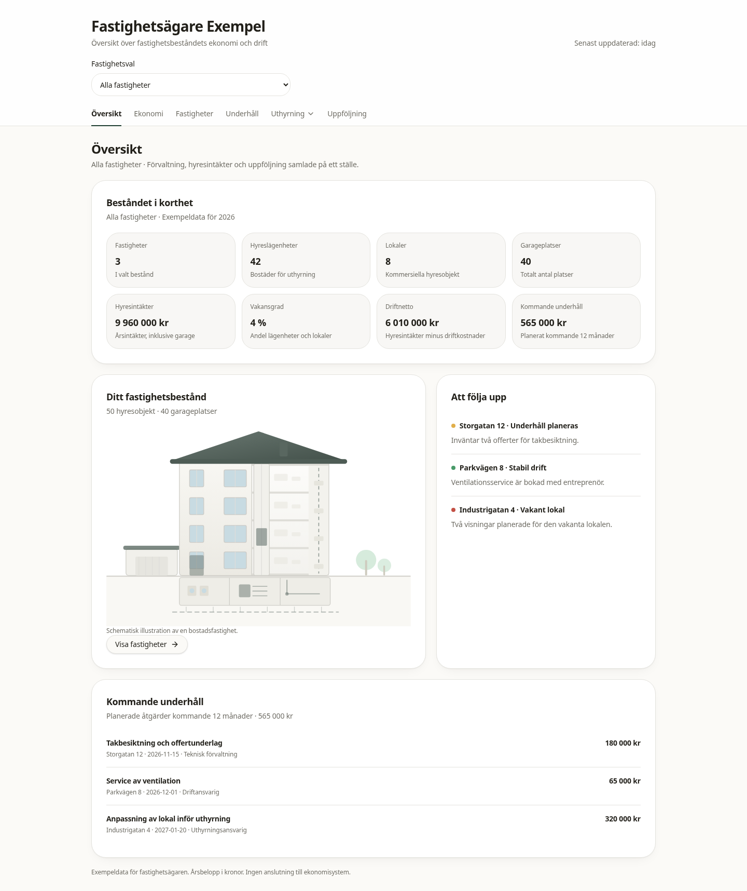
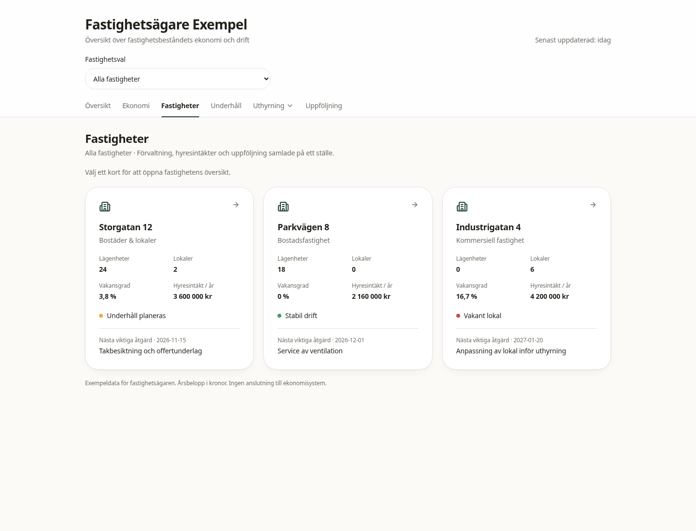
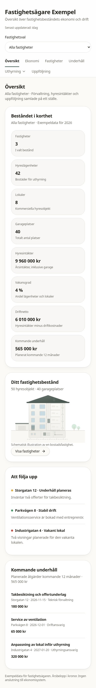

# Fastighetsägarversion

Fastighetsvalet är gemensamt för Översikt, Ekonomi, Underhåll, Uthyrning och Uppföljning och ligger i rotens React-context. Valet behålls under navigering i appen; en omladdning återgår till Alla fastigheter. Fastighetskort öppnar den valda fastighetens översikt. Listan Fastigheter visar alltid hela beståndet så att det går att byta fastighet.

Exempeldata finns i `src/data/portfolio.ts`. Årsbelopp anges i kronor. Hyresintäkter inkluderar garage. Driftnetto är hyresintäkter minus driftkostnader. Vakansgraden beräknas som vakanta hyreslägenheter och lokaler dividerat med totalt antal sådana objekt; garage visas separat. Underhåll omfattar planerade åtgärder kommande 12 månader.

Bostadsrättssidan och dess data är borttagna. Befintliga designvariabler, sidhuvud, statusmarkeringar, knappar och byggnadsillustration återanvänds. Simulatorn använder exempelantaganden för det valda beståndet och beskriver finansieringskostnader; den föreslår inte automatiska hyreshöjningar.

Kontroller:

- `npm test`: tre tester för summering, enskilda fastigheter, viktad vakans och tomt bestånd.
- `npm run typecheck`: TypeScript.
- `npm run lint`: inga fel; åtta varningar om Fast Refresh i komponentfiler.
- `npm run build`: produktionsbygge.
- Playwright/Chromium: fastighetsval under navigering, klick på fastighetskort, filtrering i alla huvudvyer, uthyrningsmenyn, mobilbredd 390 px, tangentbordslänk till innehållet, 404 för borttagen bostadsrättssida och inga JavaScript-fel.

Projektets `vite preview` söker efter `dist/server/server.js`, medan Nitro-bygget skriver till `.output`. Webbläsarkontrollen gjordes därför mot utvecklingsservern efter separat godkänt produktionsbygge.

## Skärmbilder

