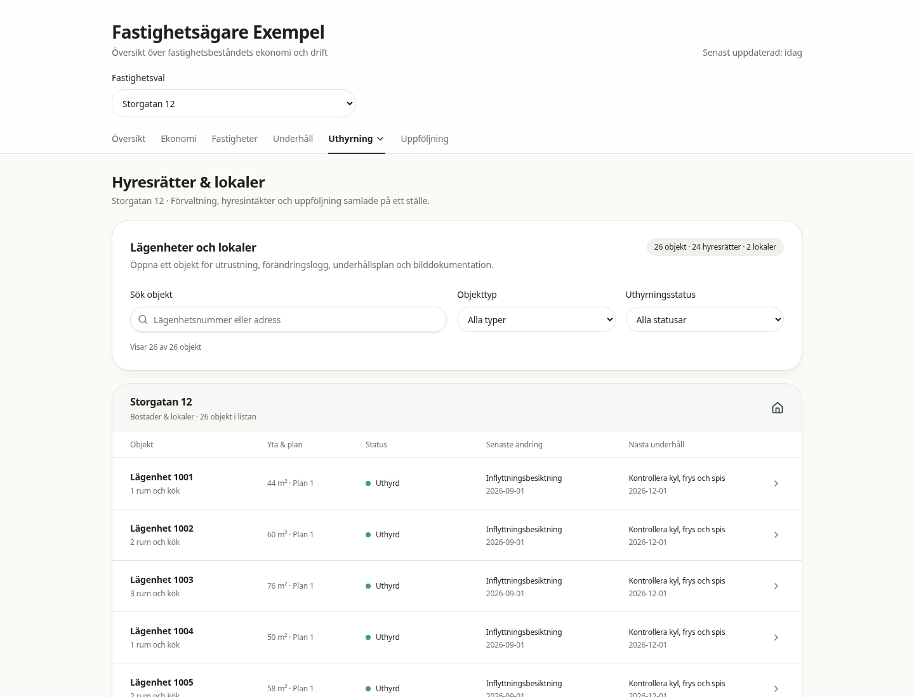
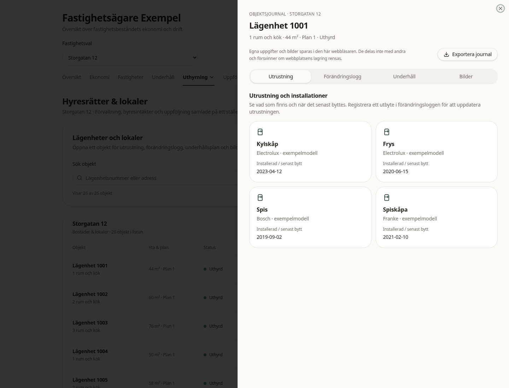
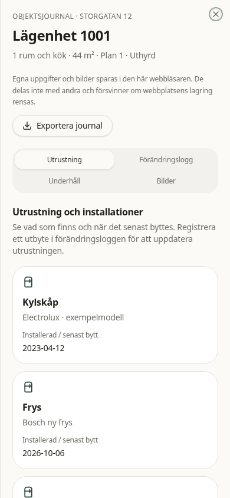

# Fastighetsägarversion

Fastighetsvalet är gemensamt för Översikt, Ekonomi, Underhåll, Uthyrning och Uppföljning och ligger i rotens React-context. Valet behålls under navigering i appen; en omladdning återgår till Alla fastigheter. Fastighetskort öppnar den valda fastighetens översikt. Listan Fastigheter visar alltid hela beståndet så att det går att byta fastighet.

Exempeldata finns i `src/data/portfolio.ts`. Årsbelopp anges i kronor. Hyresintäkter inkluderar garage. Driftnetto är hyresintäkter minus driftkostnader. Vakansgraden beräknas som vakanta hyreslägenheter och lokaler dividerat med totalt antal sådana objekt; garage visas separat. Underhåll omfattar planerade åtgärder kommande 12 månader.

Bostadsrättssidan och dess data är borttagna. Befintliga designvariabler, sidhuvud, statusmarkeringar, knappar och byggnadsillustration återanvänds. Simulatorn använder exempelantaganden för det valda beståndet och beskriver finansieringskostnader; den föreslår inte automatiska hyreshöjningar.

Kontroller:

- `npm test`: sex tester för summering, viktad vakans, objektsregister och isolerade utrustningsjournaler.
- `npm run typecheck`: TypeScript.
- `npm run lint`: inga fel; åtta varningar om Fast Refresh i komponentfiler.
- `npm run build`: produktionsbygge.
- Playwright/Chromium: fastighetsval under navigering, klick på fastighetskort, filtrering i alla huvudvyer, uthyrningsmenyn, mobilbredd 390 px, tangentbordslänk till innehållet, 404 för borttagen bostadsrättssida och inga JavaScript-fel.

Projektets `vite preview` söker efter `dist/server/server.js`, medan Nitro-bygget skriver till `.output`. Webbläsarkontrollen gjordes därför mot utvecklingsservern efter separat godkänt produktionsbygge.

## Samlad beståndsöversikt

När Alla fastigheter är valt börjar Översikt med en gemensam bild av alla tre fastigheter på samma markyta. Därefter följer beståndets summerade nyckeltal, samlad ekonomi, uthyrningsläge och prioriteringar. Fastigheterna jämförs i en gemensam tabell med totalrad, i stället för separata fastighetskort på översikten. Adresserna i tabellen öppnar detaljvyn, som har en knapp för att återgå till hela beståndet. Fastighetskorten finns kvar på sidan Fastigheter.

Webbläsarkontrollen verifierar dessutom alla tre adresser i samma bild, gemensam totalrad, 48 av 50 uthyrda hyresobjekt, 2 av 3 fastigheter som behöver uppföljning samt växling mellan bestånd och detaljvy.

## Objektsregister och objektsjournaler

Uthyrning → Hyresrätter & lokaler visar nu ett register med alla 42 lägenheter och 8 lokaler. Fastighetsvalet styr vilka objekt som visas. Sök på lägenhetsnummer eller adress och filtrera på typ eller uthyrningsstatus. Varje rad visar yta, plan, status, senaste händelse och nästa underhåll.

Öppna ett objekt för fyra flikar:

- **Utrustning:** fabrikat/modell och datum för senaste installation eller utbyte. Ett registrerat utbyte uppdaterar rätt utrustning. Ny utrustning, exempelvis diskmaskin, kan också läggas till. Ett äldre historiskt utbyte skriver inte över en senare installation.
- **Förändringslogg:** registrera utbyte, renovering, besiktning eller annan händelse, med datum, beskrivning och valfri kostnad.
- **Underhåll:** planera åtgärder med datum och budget, och markera dem som utförda. Utförda åtgärder loggas automatiskt. Budget räknas inte som faktisk kostnad.
- **Bilder:** ladda upp JPEG, PNG eller WebP, högst 5 MB per fil. Ange datum, beskrivning, tillfälle (inflyttning, utflyttning, renovering eller övrigt), före/efter/dokumentation och valfri koppling till en händelse. Bilderna öppnas i en större bildvisare.

Egna journaler och bilder sparas i IndexedDB per objekt och webbplatsadress, inklusive port. De finns kvar efter omladdning i samma webbläsarprofil, men delas inte mellan användare/enheter. Rensad webbplatslagring tar bort dem. JSON-export innehåller objektinformation, utrustning, logg, plan och bilder; import/återställning är inte byggd. Gemensam lagring, behörigheter och säkerhetskopiering behövs innan detta används som verksamhetens enda dokumentation. Lokal lagring och lagringsfel förklaras i gränssnittet.

Objektjournalernas exempelbudgetar är separata från fastigheternas övergripande underhållsbudget; de summeras inte in i beståndets ekonomiska nyckeltal i denna prototyp.

`npm test` omfattar sex tester, inklusive antal objekt/vakans per fastighet, isolering mellan journaler, uppdatering av rätt utrustning, ny utrustning och äldre händelser.

Ett återanvändbart webbläsartest finns i `tests/rental-units.browser.mjs`. Med appen igång på port 8083 och Playwright tillgängligt:

```bash
# Valfri testverktygsinstallation, utan att ändra projektets beroendefiler:
npm install --no-save --package-lock=false playwright
npx playwright install chromium
node tests/rental-units.browser.mjs
```

Testet använder en separat webbläsarprofil och kontrollerar register/filter, händelser/utbyten, underhåll, bilder före/efter, bildvisare, export, sparande efter omladdning, objektisolering, lagringsfel, fokusåtergång och mobilbredd. `TEST_BASE_URL`, `BROWSER_EXECUTABLE`, `PLAYWRIGHT_MODULE` och `SCREENSHOT_DIR` kan ange befintlig testmiljö. Skärmbilder sparas normalt under `work/browser-artifacts/`.

## Skärmbilder







