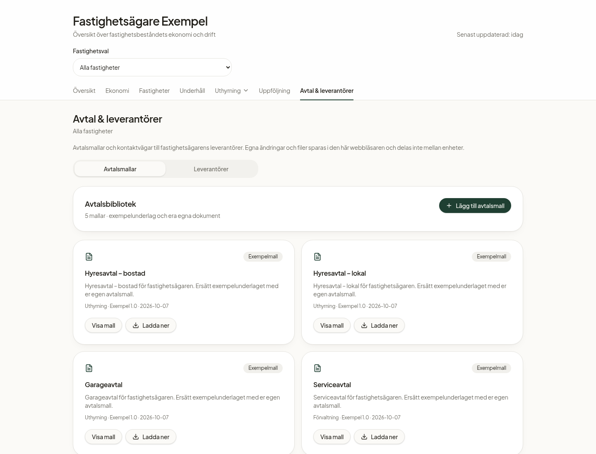
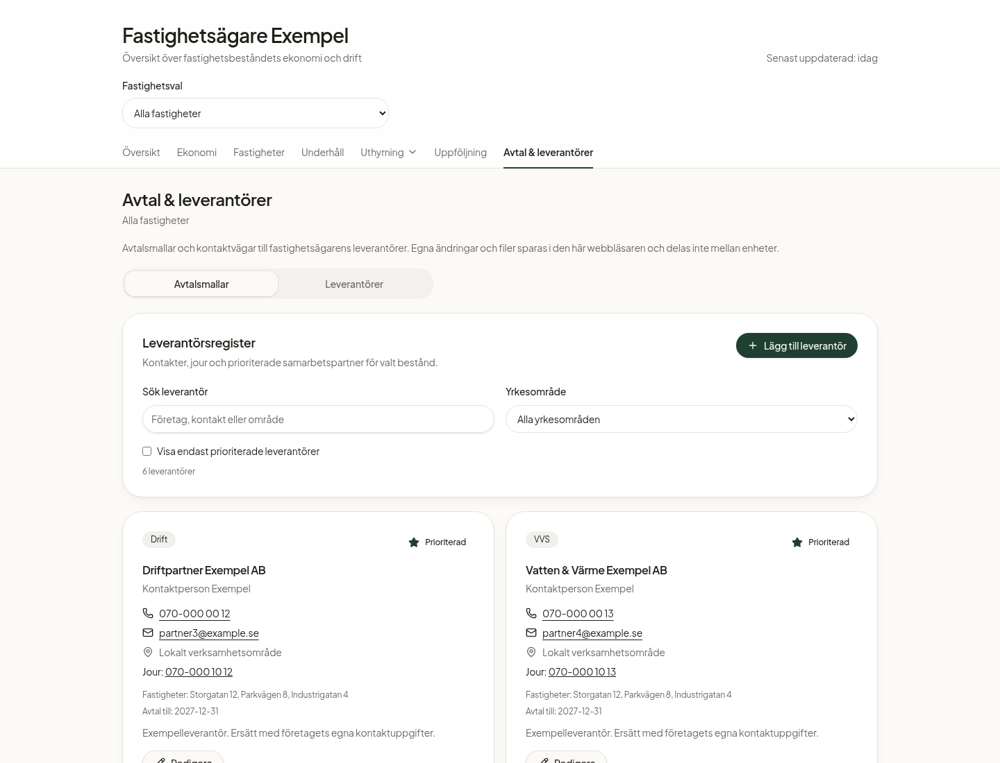
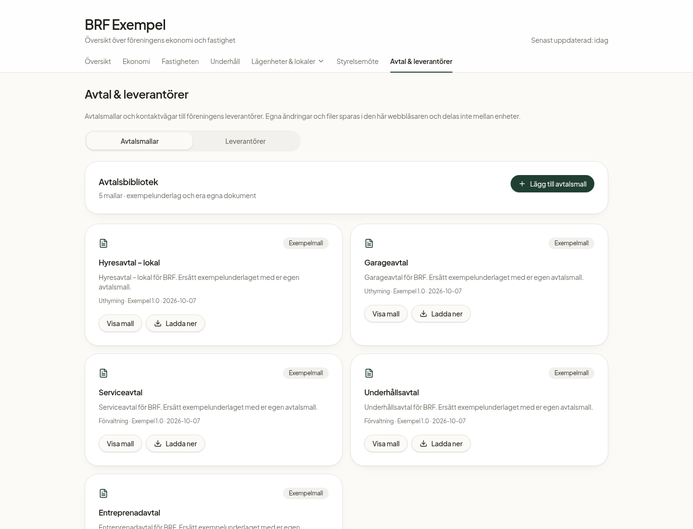

# Senaste resultatet och offlinekopia

Demokopia byggd **8 oktober 2026** från de senaste mergade huvudgrenarna i fastighetsägar- och BRF-projekten. Båda modulerna finns i ett paket. Din gamla projektmapp ändras inte.

## Hämta och visa utan wifi

**[Ladda ned Windows-paketet](https://github.com/Carolinatp-lab/property-insight-hub/raw/refs/heads/demo/offline-2026-10-08/docs/offline/Fastighetsdemo-offline-2026-10-08.zip)**

1. Spara ZIP-filen på datorn medan du har internet.
2. Högerklicka på ZIP-filen och välj **Extrahera alla**.
3. Öppna den uppackade mappen **Fastighetsdemo-offline**.
4. Dubbelklicka på **STARTA-DEMON.cmd**.
5. Välj **Fastighetsägare** eller **BRF** i menyn som öppnas.

Låt startfönstret vara öppet under visningen. Stäng det när du är klar. Paketet har en portabel runtime för **Windows 10/11 x64**; Git Bash, npm och installation behövs inte. Efter nedladdningen behövs inget wifi. Ingen merge behövs för att använda paketet.

För att bara titta på resultatet: dubbelklicka **TITTA-PA-RESULTATET.html**. Den innehåller bilder från båda modulerna och fungerar utan server, även på andra datorer.

Om webbläsaren inte öppnas automatiskt: öppna **http://127.0.0.1:8092** efter att startfönstret visar att demon körs. Modulerna använder 8093 och 8094, så din gamla utvecklingsapp på 8083 påverkas inte.

Egna ändringar sparas i samma webbläsarprofil och adress. Paketet innehåller exempeldata, inte dina tidigare lokalt sparade uppgifter. Källkod, licenser, versionsinformation och svensk instruktion följer med.

## Se resultatet här

**Fastighetsägare: avtalsmallar**

**Fastighetsägare: prioriterade leverantörer**

**BRF: avtalsmallar**

[Fastighetsägarens samlade översikt](owner-oversikt.png) · [BRF:s översikt](brf-oversikt.png) · [BRF:s leverantörer](brf-leverantorer.png)

## Verifiering och innehåll

Båda apparna är separat byggda som statiska SPA-versioner med lokalt paketerat typsnitt. Chromium-tester med alla icke-lokala nätverksanrop blockerade verifierar samtliga navigationsvyer, direktöppning, beståndsval, objektregister, malluppladdning/nedladdning, leverantörer, utförarhistorik, lagringsfel, omladdning och mobilvyer. Fastighetsägarens lägenhetsjournal behåller leverantören vid utfört underhåll. Den fristående bildvisningen testas med inbäddade bilder utan nätverksåtkomst. Direktöppning med `file://` kan inte testas eftersom testmiljöns webbläsarpolicy blockerar sådana adresser. Windows-runtime kontrolleras mot Node-leverantörens SHA-256 och ZIP-filen integritetskontrolleras.

Windows-specifik dubbelklicksstart och automatisk öppning av webbläsaren är granskade, men kan inte köras i Linux-testmiljön. En organisations datorpolicy kan begränsa körning av startfilen; bildvisningen är ett alternativ.

[Exakta källversioner](VERSION.json) · [Svensk instruktion](LAS-MIG.txt) · [Paketets SHA-256](SHA256.txt)

Det här är ett separat, fryst demopaket. Det uppdaterar inte sig självt och ändrar inte den ordinarie appen eller projektets huvudgren.
